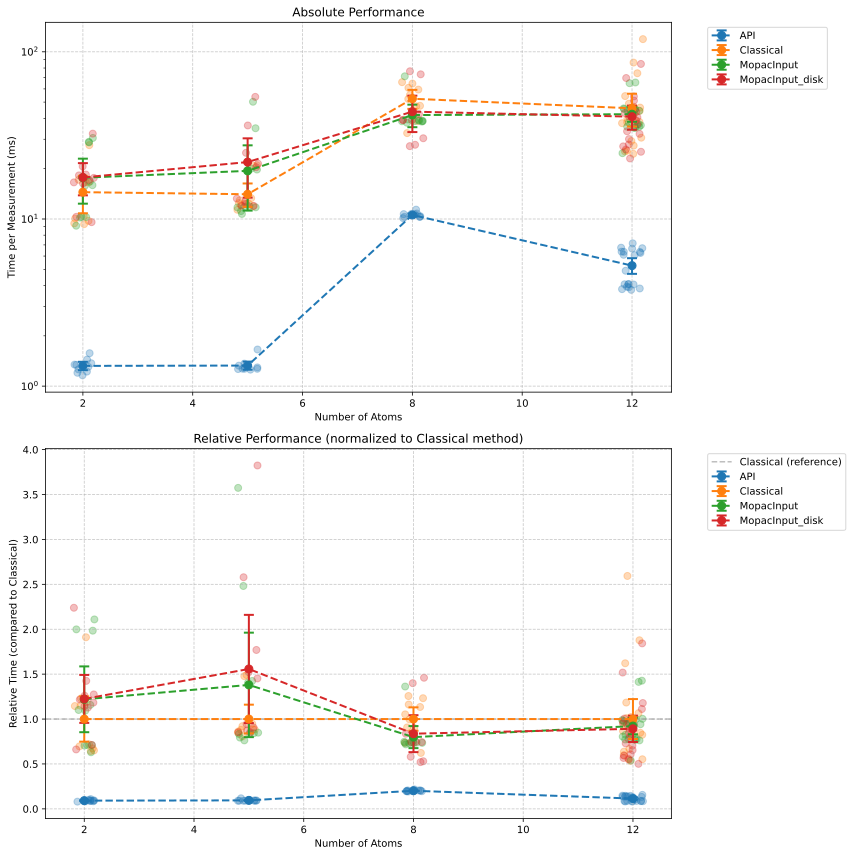

# MOPAC Method Performance Benchmark

## Method Performance Summary

| Function        |   Count |   Mean Time (ms) |   Std Dev (ms) |   Min Time (ms) |   Max Time (ms) |
|:----------------|--------:|-----------------:|---------------:|----------------:|----------------:|
| API             |      50 |            4.747 |          3.531 |           1.161 |          11.372 |
| Classical       |      50 |           34.554 |         22.962 |           9.314 |         119.086 |
| MopacInput      |      50 |           32.715 |         15.433 |           9.112 |          71.373 |
| MopacInput_disk |      50 |           33.065 |         17.631 |           9.573 |          84.62  |

## Statistics by Molecule

### F (2 atoms)

| Function        |   Measurements |    Mean |   Std Dev |    Min |     Max |
|:----------------|---------------:|--------:|----------:|-------:|--------:|
| API             |             10 |  1.3221 |    0.1228 | 1.1613 |  1.5743 |
| Classical       |             10 | 14.4672 |    5.8806 | 9.3144 | 27.6431 |
| MopacInput      |             10 | 17.6483 |    8.5569 | 9.112  | 30.5174 |
| MopacInput_disk |             10 | 17.7136 |    6.2329 | 9.5732 | 32.3947 |

### C (5 atoms)

| Function        |   Measurements |    Mean |   Std Dev |     Min |     Max |
|:----------------|---------------:|--------:|----------:|--------:|--------:|
| API             |             10 |  1.3279 |    0.1202 |  1.2551 |  1.6568 |
| Classical       |             10 | 14.0596 |    3.6253 | 11.352  | 20.9541 |
| MopacInput      |             10 | 19.4025 |   13.191  | 10.7203 | 50.2496 |
| MopacInput_disk |             10 | 21.8966 |   13.662  | 11.9769 | 53.756  |

### CC(=O)O (8 atoms)

| Function        |   Measurements |    Mean |   Std Dev |     Min |     Max |
|:----------------|---------------:|--------:|----------:|--------:|--------:|
| API             |             10 | 10.566  |    0.3662 | 10.1089 | 11.3721 |
| Classical       |             10 | 52.3995 |   11.0056 | 32.6375 | 65.8298 |
| MopacInput      |             10 | 41.8506 |   10.3838 | 37.6378 | 71.3734 |
| MopacInput_disk |             10 | 43.8661 |   17.3851 | 27.2744 | 76.4909 |

### c1ccccc1 (12 atoms)

| Function        |   Measurements |    Mean |   Std Dev |     Min |      Max |
|:----------------|---------------:|--------:|----------:|--------:|---------:|
| API             |             20 |  5.2594 |    1.2882 |  3.7676 |   7.1541 |
| Classical       |             20 | 45.9214 |   23.2976 | 24.5339 | 119.086  |
| MopacInput      |             20 | 42.337  |    9.5894 | 24.7524 |  65.5366 |
| MopacInput_disk |             20 | 40.9253 |   15.3474 | 23.0176 |  84.6204 |

