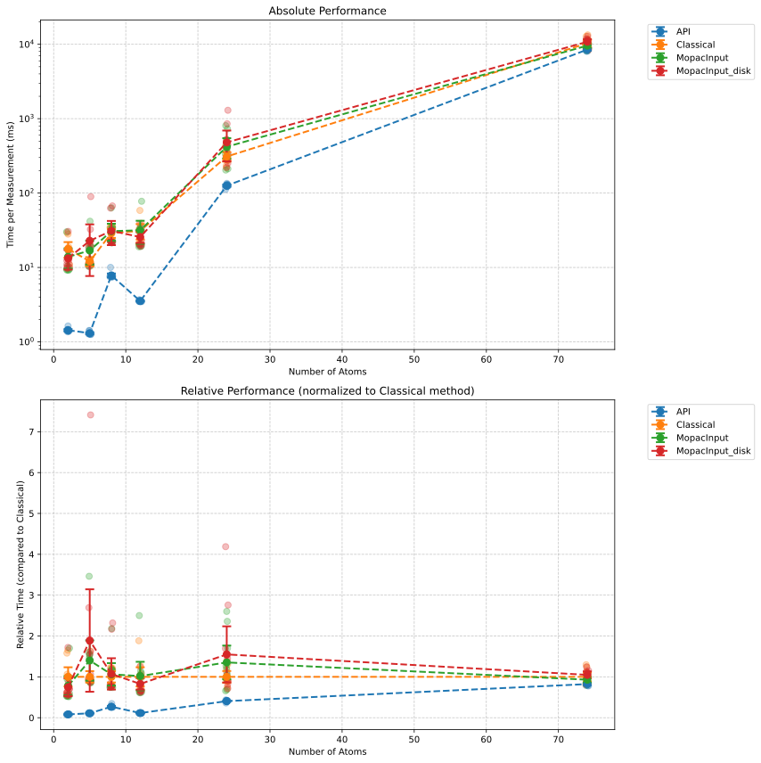

# MOPAC Method Performance Benchmark

## Method Performance Summary

| Function        |   Count |   Mean Time (ms) |   Std Dev (ms) |   Min Time (ms) |   Max Time (ms) |
|:----------------|--------:|-----------------:|---------------:|----------------:|----------------:|
| API             |      60 |          1476.02 |        3263.64 |           1.034 |         9390.16 |
| Classical       |      60 |          1896.35 |        4048.85 |           9.428 |        11947.2  |
| MopacInput      |      60 |          2052.56 |        4472.13 |           9.603 |        14495.9  |
| MopacInput_disk |      60 |          1968.25 |        4272.49 |           9.515 |        14383.6  |

## Statistics by Molecule

### F (2 atoms)

| Function        |   Measurements |    Mean |   Std Dev |    Min |     Max |
|:----------------|---------------:|--------:|----------:|-------:|--------:|
| API             |             10 |  1.3203 |    0.1862 | 1.159  |  1.825  |
| Classical       |             10 | 14.2498 |    7.0186 | 9.4283 | 31.6226 |
| MopacInput      |             10 | 13.7748 |    3.9522 | 9.603  | 18.0322 |
| MopacInput_disk |             10 | 14.7407 |   10.0791 | 9.515  | 42.4487 |

### C (5 atoms)

| Function        |   Measurements |    Mean |   Std Dev |     Min |     Max |
|:----------------|---------------:|--------:|----------:|--------:|--------:|
| API             |             10 |  1.1863 |    0.2203 |  1.0338 |  1.7793 |
| Classical       |             10 | 16.839  |    7.2052 | 11.253  | 34.3326 |
| MopacInput      |             10 | 17.6027 |    5.5942 | 10.8391 | 29.3117 |
| MopacInput_disk |             10 | 23.5945 |    9.2638 | 15.2314 | 42.0465 |

### CC(=O)O (8 atoms)

| Function        |   Measurements |    Mean |   Std Dev |     Min |     Max |
|:----------------|---------------:|--------:|----------:|--------:|--------:|
| API             |             10 |  9.2257 |    0.1738 |  9.0513 |  9.6733 |
| Classical       |             10 | 33.0142 |   14.12   | 23.1685 | 69.5339 |
| MopacInput      |             10 | 34.6351 |   12.3031 | 22.6248 | 65.7621 |
| MopacInput_disk |             10 | 40.0474 |   23.767  | 22.0055 | 93.2545 |

### c1ccccc1 (12 atoms)

| Function        |   Measurements |    Mean |   Std Dev |     Min |     Max |
|:----------------|---------------:|--------:|----------:|--------:|--------:|
| API             |             10 |  4.117  |    0.151  |  4.0151 |  4.5369 |
| Classical       |             10 | 34.9627 |   14.483  | 22.2522 | 61.5141 |
| MopacInput      |             10 | 38.9638 |   19.2875 | 21.7664 | 85.586  |
| MopacInput_disk |             10 | 33.2226 |   11.8323 | 20.4991 | 61.352  |

### CCc1ccccc1CC (24 atoms)

| Function        |   Measurements |    Mean |   Std Dev |     Min |     Max |
|:----------------|---------------:|--------:|----------:|--------:|--------:|
| API             |             10 | 143.775 |   18.9358 | 122.778 | 191.159 |
| Classical       |             10 | 501.119 |  141.641  | 305.059 | 782.824 |
| MopacInput      |             10 | 361.903 |  182.163  | 247.534 | 810.506 |
| MopacInput_disk |             10 | 434.551 |   97.2926 | 309.192 | 571.307 |

### C[C@H](CCCC(C)C)[C@H]1CC[C@@H]2[C@@]1(CC[C@H]3[C@H]2CC=C4[C@@]3(CC[C@@H](C4)O)C)C (74 atoms)

| Function        |   Measurements |    Mean |   Std Dev |     Min |      Max |
|:----------------|---------------:|--------:|----------:|--------:|---------:|
| API             |             10 |  8696.5 |   542.124 | 7990.59 |  9390.16 |
| Classical       |             10 | 10777.9 |  1438.03  | 8249.27 | 11947.2  |
| MopacInput      |             10 | 11848.5 |  1740.56  | 9303.27 | 14495.9  |
| MopacInput_disk |             10 | 11263.3 |  2076.11  | 9240.35 | 14383.6  |

